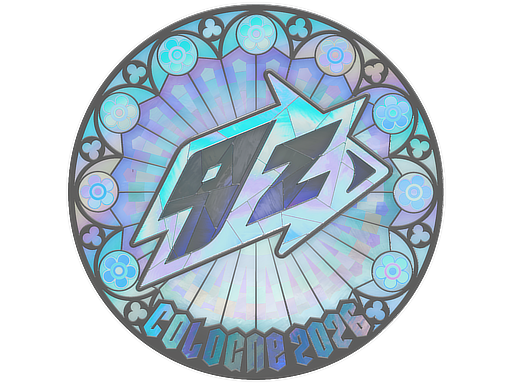
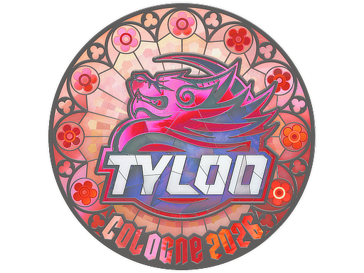
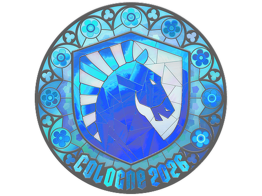
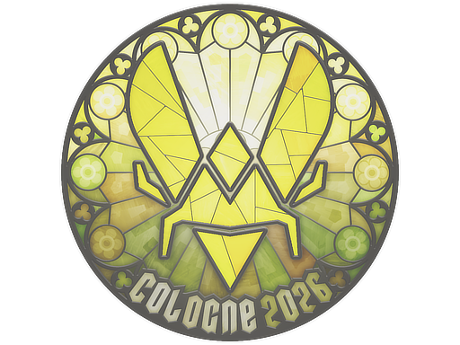
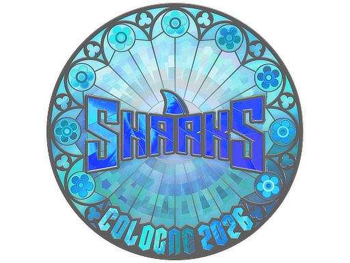

# 🎯 CS2 Sticker Tracker — Cologne 2026 (Holo)

🇫🇷 [Français](#français) · 🇺🇸 [English](#english)

Traque automatiquement le **prix Steam Market** d'une sélection de stickers
**CS2 Holo du Major IEM Cologne 2026** et envoie un rapport sur **Telegram**.
Tourne en autonomie via **GitHub Actions** (cron) — zéro serveur à gérer.

> Origine : suivi des stickers visibles sur le post de
> [@JesperCS2](https://x.com/i/status/2068817255429730602)
> (« Picked up some more cologne 2026 holos … one of the best investing
> opportunities of 2026 »).

---

## Français

### 📦 Les stickers suivis

La sélection (et les quantités) correspond exactement aux stickers de la capture.
Chaque sticker a été identifié en comparant le logo à l'**art officiel Steam**.

| Sticker (Holo, Cologne 2026) | Logo | Qté | Prix réf. (22/06/26) |
|---|---|---:|---:|
|  **FURIA** | panthère bleue | 3 | 25,19 € |
|  **9z Team** | éclair « 9z » | 3 | 8,89 € |
|  **Falcons** | faucon vert | 1 | 51,48 € |
|  **Legacy** | ruban doré | 1 | 8,39 € |
|  **FlyQuest** | feuille verte | 1 | 14,04 € |
|  **TYLOO** | dragon rouge | 1 | 16,10 € |
|  **Team Liquid** | cheval cyan | 1 | 25,56 € |
|  **Vitality** | « V » jaune/violet | 4 | 16,83 € |
|  **Sharks Esports** | texte SHARKS | 1 | 9,51 € |

La liste est entièrement éditable dans [`stickers.json`](stickers.json)
(`name`, `market_hash_name`, `qty`, `ref_price`). Pour suivre d'autres skins/stickers,
ajoute simplement une ligne avec le `market_hash_name` exact du Steam Market.

> ⚠️ Cologne 2026 n'a **pas de capsules** : Valve vend les stickers à l'unité via
> le *Sticker Shop* à prix dynamique. Les prix suivis ici sont ceux du **marché
> communautaire Steam** (revente entre joueurs), seule source publique gratuite.

### ⚙️ Fonctionnement

1. Pour chaque sticker, appel de l'API gratuite Steam `priceoverview`
   (prix le plus bas, médian, volume).
2. Comparaison avec le **snapshot précédent** et avec le **prix de référence**.
3. Calcul de la **valeur du portefeuille** (prix × quantité).
4. Envoi d'un rapport **Telegram** (avec flèches ▲▼ et alertes sur les gros mouvements).
5. Sauvegarde de l'historique dans [`data/history.json`](data/) + `data/prices.csv`.

### 🤖 Configuration du bot Telegram

Le projet réutilise **ton bot Telegram existant**. Il te faut :

- `TELEGRAM_BOT_TOKEN` : le token donné par [@BotFather](https://t.me/BotFather).
- `TELEGRAM_CHAT_ID` : l'ID de la conversation où recevoir les messages.
  (Envoie un message à ton bot puis ouvre
  `https://api.telegram.org/bot<TOKEN>/getUpdates` pour lire le `chat.id`.)

Deux façons de les fournir :

**En local** — copie `config.example.json` → `config.json` et remplis-le
(`config.json` est git-ignoré, ton token ne sera jamais committé) :

```bash
cp config.example.json config.json
python tracker.py
```

**Sur GitHub Actions** — ajoute des *Repository secrets*
(`Settings → Secrets and variables → Actions`) :

| Secret | Valeur |
|---|---|
| `TELEGRAM_BOT_TOKEN` | ton token BotFather |
| `TELEGRAM_CHAT_ID` | ton chat id |

(Optionnel : variable `STICKER_CURRENCY`, ex. `EUR`, `USD`…)

### 🔄 Le workflow (autonomie 24/7)

[`.github/workflows/sticker-tracker.yml`](../.github/workflows/sticker-tracker.yml) :

- s'exécute **toutes les 6 h** (cron) + bouton **Run workflow** manuel ;
- lance le tracker, **commit l'historique** des prix dans le repo ;
- envoie le rapport Telegram.

> ℹ️ GitHub n'exécute les workflows planifiés que depuis la **branche par défaut**.
> Le cron démarrera donc une fois la PR mergée sur `master`. Avant ça, utilise
> « Run workflow » (workflow_dispatch) pour un test immédiat.

### 🖥️ Utilisation locale

```bash
python tracker.py            # fetch + Telegram + historique
python tracker.py --dry-run  # affichage console seulement (ni écriture ni envoi)
python tracker.py --no-telegram
```

Aucune dépendance externe : **Python 3.9+** (uniquement la lib standard).

### 🔧 Options (`config.json`)

| Clé | Défaut | Description |
|---|---|---|
| `currency` | `EUR` | Devise Steam (`EUR`, `USD`, `GBP`, `BRL`…). |
| `alert_threshold_pct` | `5.0` | % de variation (vs run précédent) qui déclenche une alerte 🚨. |
| `send_mode` | `always` | `always` = rapport à chaque run ; `on_change` = seulement si mouvement. |
| `request_delay` | `3.0` | Secondes entre 2 appels Steam (anti rate-limit). |
| `max_retries` | `4` | Tentatives avec backoff exponentiel (gère le HTTP 429). |

### ⚠️ Avertissement

Projet à usage personnel / informatif. Les prix proviennent du Steam Community
Market et sont indicatifs ; ceci n'est pas un conseil en investissement.

---

## English

Automatically tracks the **Steam Market price** of a selection of **CS2 Holo
stickers from the IEM Cologne 2026 Major** and sends a report to **Telegram**.
Runs autonomously via **GitHub Actions** (cron) — no server needed.

### Tracked stickers

The selection and quantities match the screenshot from
[@JesperCS2](https://x.com/i/status/2068817255429730602). Each sticker was
identified by comparing its logo to the **official Steam art**: FURIA, 9z Team,
Falcons, Legacy, FlyQuest, TYLOO, Team Liquid, Vitality, Sharks Esports
(all *Holo · Cologne 2026*). Fully editable in [`stickers.json`](stickers.json).

> Cologne 2026 has **no capsules** — Valve sells stickers individually in the
> dynamic-priced Sticker Shop. Prices tracked here come from the **Steam
> Community Market** (the only free public source).

### How it works

For each sticker it queries the free Steam `priceoverview` API, compares against
the previous snapshot and a reference price, computes the **portfolio value**,
sends a **Telegram** report (with ▲▼ arrows and big-move alerts), and stores the
history in `data/history.json` + `data/prices.csv`.

### Telegram setup (reuse your existing bot)

Provide `TELEGRAM_BOT_TOKEN` and `TELEGRAM_CHAT_ID` either via a local
`config.json` (copied from `config.example.json`, git-ignored) or as **GitHub
Actions secrets**.

### Workflow

[`.github/workflows/sticker-tracker.yml`](../.github/workflows/sticker-tracker.yml)
runs every 6 h (cron) + manual dispatch, commits the price history, and sends the
Telegram report. Scheduled runs only fire from the default branch, so the cron
activates once the PR is merged to `master`; use *Run workflow* to test before that.

### Local usage

```bash
python tracker.py            # fetch + Telegram + history
python tracker.py --dry-run  # console only
python tracker.py --no-telegram
```

No external dependencies — **Python 3.9+** standard library only.

### Disclaimer

Personal / informational use only. Prices come from the Steam Community Market
and are indicative; this is not financial advice.
